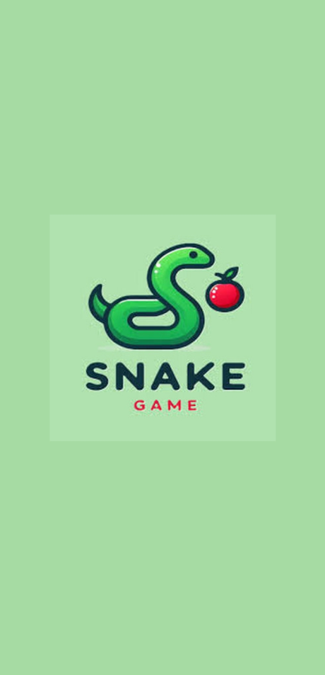
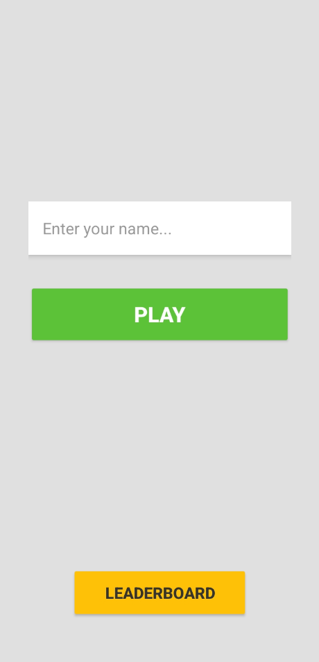
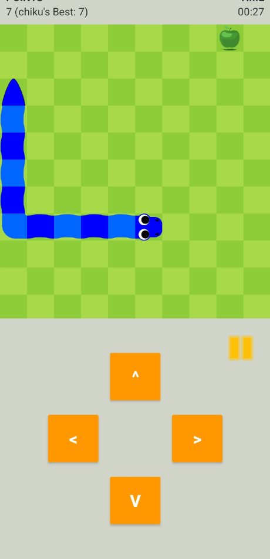
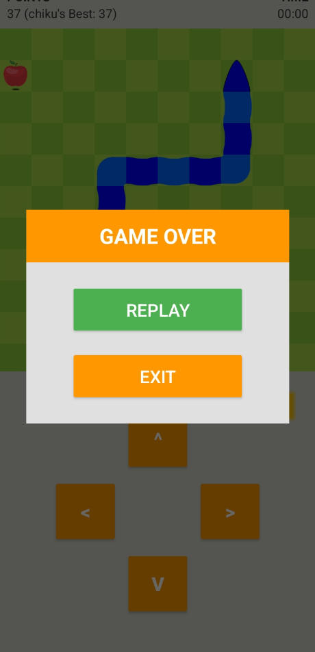
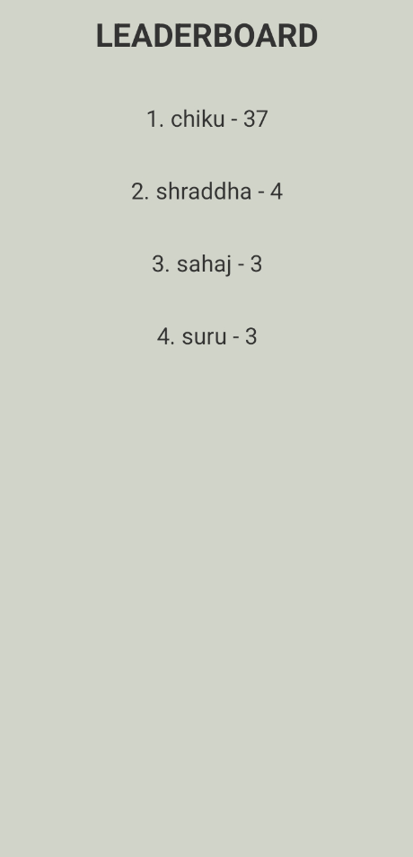

# 🐍 Snake Game Android

A fully-featured classic Snake Game built for Android using **Java** and the **MVC (Model-View-Controller)** architecture.

## 📱 Screenshots

  
  
  
  
  

  <i>Splash &nbsp;·&nbsp; Login &nbsp;·&nbsp; Gameplay &nbsp;·&nbsp; Game Over &nbsp;·&nbsp; Leaderboard</i>

---

## ✨ Features
- 🎮 On-screen **D-Pad controls** for intuitive gameplay
- 👤 **Multi-user login** — enter your name before playing
- 🏆 **Leaderboard** — tracks and ranks all players' high scores on a single device
- 💣 **Bomb obstacles** with a countdown warning before they spawn
- 🍎 Multiple food types (Red Apple, Green Apple, Golden Apple)
- ⏸️ Custom **Pause dialog** (Home / Restart / Resume)
- 💀 Custom **Game Over dialog** (Replay / Exit)
- 🌟 **Splash Screen** with branded logo
- 📱 Play Store ready — full English UI, portrait orientation, min SDK 26

## 🛠️ Tech Stack
- **Language:** Java
- **Architecture:** MVC (Model-View-Controller)
- **Data Storage:** SharedPreferences (high scores)
- **Build:** Gradle 8.7 · AGP 8.5.0 · Target SDK 34 · Java 17

## 👥 Team
Built by a team of 4 as part of MCA Android Development coursework.
